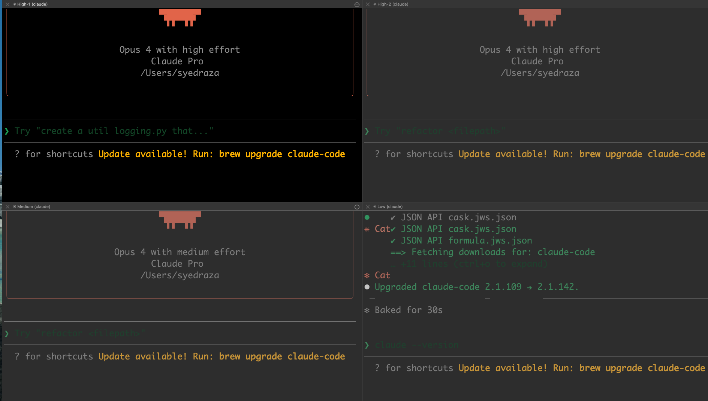

# syed-agentic-engineering-config

Shell config, Claude Code workspace helpers, and status line tooling for agentic engineering workflows on macOS.

Tested with **Claude Code CLI** on macOS + iTerm2.



---

## What's Inside

| File | Purpose |
|------|---------|
| `install.sh` | One-shot idempotent installer |
| `shell.zsh` | `t` command + shell helpers (sourced by `~/.zshrc`) |
| `statusline.sh` | Claude Code status line script (model · git branch · context bar) |
| `statusline-daemon.sh` | Background daemon that keeps the status line cache fresh every 2s |
| `tmux.conf` | tmux config with vi keys, mouse support, and smart copy-to-clipboard |
| `bin/clip` | Cross-platform clipboard shim (`pbcopy` / `wl-copy` / `xclip` / `xsel`) |
| `.claude/commands/smell.md` | `/smell` slash command — code smell review (Clean Code + GoF + Python) |

---

## Requirements

- macOS with [iTerm2](https://iterm2.com)
- [Claude Code CLI](https://claude.ai/code) (`claude` on your PATH)
- `jq` — `brew install jq`
- tmux (optional, used by `tmux.conf`) — `brew install tmux`

---

## Install

```sh
git clone https://github.com/majidraza1228/syed-agentic-engineering-config.git ~/syed-agentic-engineering-config
ln -s ~/syed-agentic-engineering-config ~/src/agentic-config   # canonical path used internally
cd ~/syed-agentic-engineering-config
./install.sh && exec zsh
```

`install.sh` does the following (all idempotent):

1. Symlinks `~/.tmux.conf` → `tmux.conf` (backs up any existing file)
2. Appends `source "$HOME/src/agentic-config/shell.zsh"` to `~/.zshrc` (if not already present)
3. Merges `statusLine` + `SessionStart`/`Stop` hooks into `~/.claude/settings.json` via `jq`
4. Symlinks any slash commands from `.claude/commands/` into `~/.claude/commands/`

---

## The `t` Command — 4-Pane Claude Workspace

Running `t` (or `cwork`) opens a single iTerm2 window split into a 2×2 grid, each pane launching Claude Code with a different thinking effort level:

```
┌─────────────────────┬─────────────────────┐
│  opus-4.7 │ high    │  opus-4.7 │ high    │
│  (High-1)           │  (High-2)           │
├─────────────────────┼─────────────────────┤
│  opus-4.7 │ medium  │  opus-4.7 │ low     │
│  (Medium)           │  (Low)              │
└─────────────────────┴─────────────────────┘
```

### Effort levels

Claude Code's `--effort` flag controls how much thinking budget the model uses per response:

| Level | Use when |
|-------|----------|
| `high` | Complex reasoning, architecture decisions, hard bugs |
| `medium` | Standard feature work, code review, refactoring |
| `low` | Quick lookups, simple edits, grep/explore tasks |

Using multiple effort levels in parallel lets you route tasks by complexity without context-switching — assign hard problems to a `high` pane and keep `low`/`medium` panes free for fast turnaround work.

### Changing the model

Edit `shell.zsh` and replace `claude-opus-4-7` with any model alias Claude Code supports:

```zsh
# full model ID
--model claude-opus-4-6

# or short alias
--model opus
--model sonnet
```

### Locking pane titles in iTerm2

By default iTerm2 lets running processes overwrite the pane title. To keep the `opus-4.7 | high` labels visible:

> iTerm2 → Settings → Profiles → Terminal → uncheck **"Allow title reporting"** and **"Terminal may set tab/session title"**

---

## Status Line

The status line renders inside Claude Code's bottom bar and shows:

```
opus-4.7  │  main +wt:my-branch  │  [████████████░░░░░░░░] 61% (122k/200k)
```

- **Model slug** — derived from the active model's display name
- **Git segment** — current branch; appends `+wt:<name>` when inside a worktree
- **Context bar** — 20-character block bar showing % of context window used, with token counts

### How it works

`statusline.sh` is invoked by Claude Code on every assistant turn (configured via `~/.claude/settings.json`). To avoid blocking the UI, it reads a cache file written by the background daemon:

1. `SessionStart` hook → `statusline-daemon.sh start` — spawns a background loop that refreshes the cache every 2s
2. `Stop` hook → `statusline-daemon.sh stop` — kills the daemon when the session ends
3. `statusline.sh` — reads the cache if fresh (≤3s old); falls back to computing inline if stale

Cache files live in `~/.claude/`:

| File | Contents |
|------|----------|
| `.statusline.cache` | Last computed status line string |
| `.statusline.input` | Last JSON payload received from Claude Code |
| `.statusline.pid` | Daemon PID |

---

## tmux Config

`tmux.conf` is a minimal, vi-keyed config focused on copy-paste ergonomics:

| Feature | Detail |
|---------|--------|
| Mouse support | `set -g mouse on` — scroll, click to select pane, drag to select text |
| Copy on drag | Mouse drag in copy mode → clipboard via `bin/clip` + green confirmation banner |
| Double-click | Selects and copies the word under cursor |
| Triple-click | Selects and copies the entire line |
| Smart scroll | `WheelDown` at the bottom of copy mode exits back to normal mode |
| Pane border | Shows pane index + current command at the top of each pane |
| History | 50,000 lines scrollback |

### bin/clip

Cross-platform clipboard shim used by tmux bindings. Tries in order:
`pbcopy` (macOS) → `wl-copy` (Wayland) → `xclip` → `xsel`

---

## Customization

### Add more panes or change effort layout

Edit the `t()` function in `shell.zsh`. The pane layout uses iTerm2 AppleScript splits:

```zsh
tell s1
    set s2 to (split vertically with default profile)   # left | right
end tell
tell s1
    set s3 to (split horizontally with default profile) # top / bottom
end tell
```

---

## Slash Commands

### `/smell` — Code smell review

Runs a 5-step analysis against your current git diff. Use it inside any Claude Code session:

```
/smell              # diffs against origin/main by default
/smell my-branch    # diffs against a specific branch
```

**Three catalogs:**

| Catalog | What it checks |
|---------|---------------|
| **Clean Code** (Martin) | Naming, function shape, duplication, abstraction levels, magic numbers, Law of Demeter — 35 IDs (e.g. `CC.G5`, `CC.G30`, `CC.N1`) |
| **Gang of Four** | Missing design patterns (Strategy, Factory, Observer, etc.) + 7 design smells (rigidity, fragility, opacity, etc.) |
| **Python-specific** | 35 runtime/security IDs — `PY.BARE-EXCEPT`, `PY.MUTABLE-DEFAULT`, `PY.BLOCKING-IN-ASYNC`, and more |

Every finding is assigned a severity (**BLOCKER → HIGH → MEDIUM → LOW → NIT**) with a one-sentence fix. The command auto-selects the right lens based on the diff — Clean Code for inline edits and naming, GoF for new classes and hierarchies.

**Example output:**
```markdown
# Smell Report
Base: `origin/main`
Classification: `feature`
Primary lens: `Clean Code`

## Findings
### [HIGH] CC.G5 — src/payments.py:42-60
Duplicated retry logic across three call sites.
Fix: extract into a shared `retry_with_backoff()` helper.
```

### Add a slash command

Drop a `.md` file into `.claude/commands/` and re-run `./install.sh`. It will be symlinked into `~/.claude/commands/` and available as `/<filename>` inside Claude Code.

### Override settings without editing this repo

`install.sh` merges into `~/.claude/settings.json` — it never overwrites keys that already exist. Add your own keys directly to `settings.json` and they will be preserved across re-runs.

---

## Uninstall

```sh
# Remove shell source line
sed -i '' '/agentic-config\/shell.zsh/d' ~/.zshrc

# Remove tmux symlink
rm ~/.tmux.conf

# Remove status line hooks from settings.json (manual edit or jq)
jq 'del(.statusLine, .hooks)' ~/.claude/settings.json > /tmp/s.json && mv /tmp/s.json ~/.claude/settings.json
```
